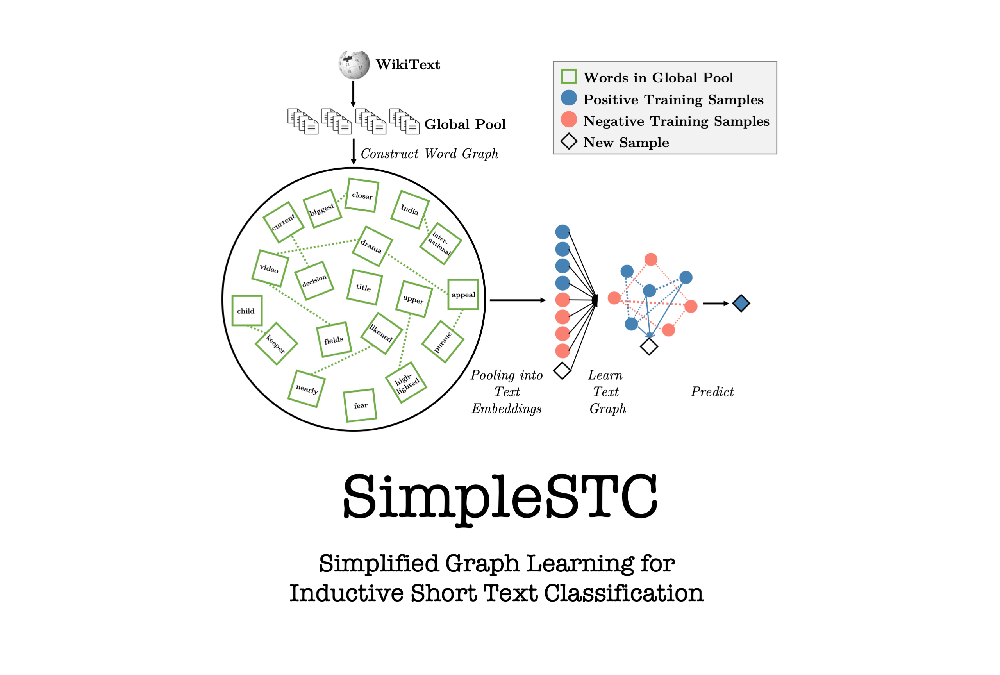

# SimpleSTC-EMNLP22

<p align="center">


This repository provides the source codes of ["Simplified Graph Learning for Inductive Short Text Classification"](https://aclanthology.org/2022.emnlp-main.735/) published in *EMNLP 2022*. 


Please cite our paper if you find it helpful. Thanks. 
```
@inproceedings{zheng-etal-2022-simplified,
    title = "Simplified Graph Learning for Inductive Short Text Classification",
    author = "Zheng, Kaixin  and
      Wang, Yaqing  and
      Yao, Quanming  and
      Dou, Dejing",
    booktitle = "Proceedings of the 2022 Conference on Empirical Methods in Natural Language Processing",
    month = dec,
    year = "2022",
    address = "Abu Dhabi, United Arab Emirates",
    publisher = "Association for Computational Linguistics",
    url = "https://aclanthology.org/2022.emnlp-main.735",
    pages = "10717--10724",
    abstract = "Short text classification (STC) is hard as short texts lack context information and labeled data is not enough. Graph neural networks obtain the state-of-the-art on STC since they can merge various auxiliary information via the message passing framework. However, existing works conduct transductive learning, which requires retraining to accommodate new samples and takes large memory. In this paper, we present SimpleSTC which handles inductive STC problem but only leverages words. We construct word graph from an external large corpus to compensate for the lack of semantic information, and learn text graph to handle the lack of labeled data. Results show that SimpleSTC obtains state-of-the-art performance with lower memory consumption and faster inference speed.",
}
```

## Environment  
We provide both the **PyTorch** and **PaddlePaddle** implementations of SimpleSTC in this repository: 

### Torch Version:
- python 3.7
- pytorch 1.2

### Paddle Version:
- python 3.7
- paddlepaddle 2.2

## Quick Start

As the dataset is too large to be uploaded, we cannot put them into this file. You can process the raw data as the instruction in the "process_data" folder.

Then, please run the code with 

```
python train/train.py
```

choose the dataset with 

```
python train/train.py --dataset tagmynews
```
